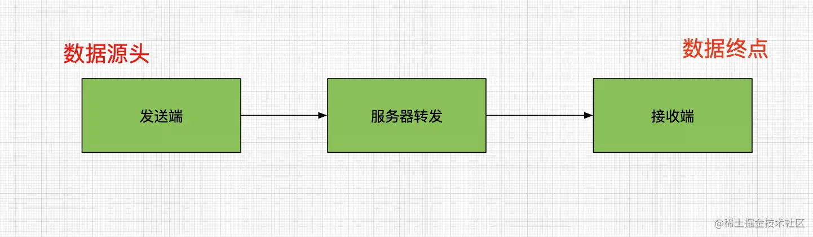
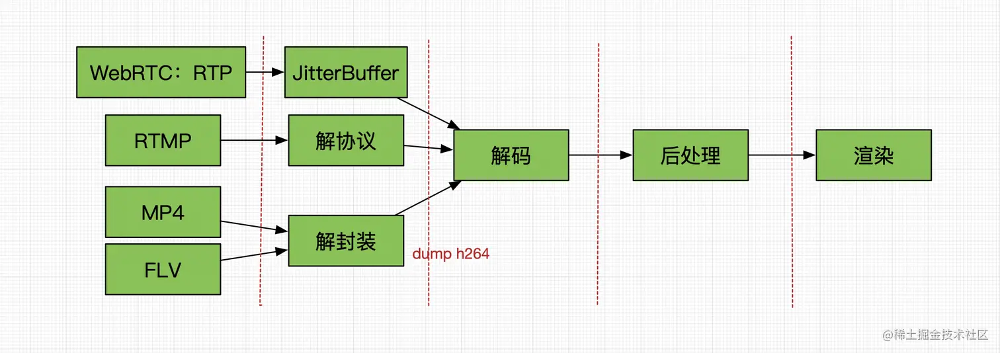
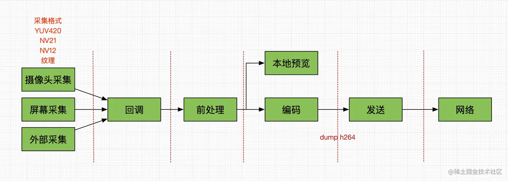
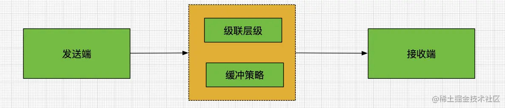
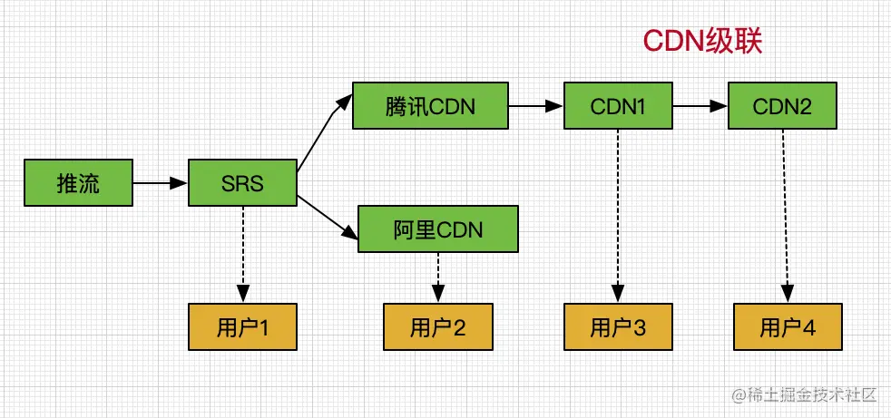
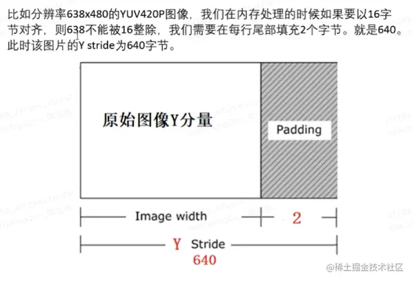
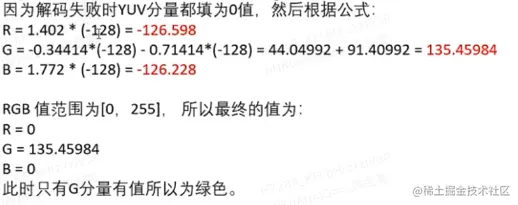

### 背景

视频典型画面不正常主要包含画面卡顿、画面模糊、画面不显示、画面花屏这 4 类问题。本文主要介绍的是画面花屏的情况，这里的画面花屏包含了花屏、闪屏、绿屏、黑屏。视频花屏是多媒体工程师最常见的问题之一，也是最棘手的问题之一，笔者此前也数次遇到这样的问题，今天在此总结分享下经验，希望阅读到这篇文章的小伙伴们都能够有所收获。

### 问题定位

很多小伙伴碰到此类问题，往往感觉束手无策，本质原因还是对于视频链路不太清晰，导致无从下手。当遇到视频花屏时，首先要定位是最先出现的花屏的是哪个阶段产生的，再逐层进行分析定位。以 RTC 视频为例，分为发送端、服务器、接收端，其具体流程如下：

如果发现对端显示不正常，排查顺序：

（1）排查接收端；

（2）排查发送端 ；

（3）排查服务器；

如果发现是本端显示不正常，排查顺序：

（1）排查发送端 ；

（2） 其次是分环节排查。

### 接收端流程

**播放器流程**
 
rtmp-解协议-解码-后处理-渲染。

mp4/flv-解封装-解码-后处理-渲染。

播放器数据来源来自网络视频或者本地视频。

如果本地视频出现问题，可以先使用其他播放器 VLC/ffplay 播放本地的视频看看。

如果网络视频出现问题，可以保存解码前的数据，使用 ffplay 播放 h264 试试。

根据播放器的 2 种流程，还有可能在解协议或者解封装的阶段，因此可以在这之后 dump h264 码流看看。

**WebRTC接收端流程**

rtp-jitterbuffer-解码-后处理-渲染。

网络部分： 嵌入式设备用了webrtc，其网卡对于带宽限制严重，会造成数据包丢失严重；另外就是实际网络情况差，导致接收端数据包丢失严重；都有可能导致生成的画面花屏。

解码部分： 硬件解码容易出错，一是硬件解码器会因各种厂商定制化存在差异，兼容性问题多，容易出现报错的情况，二是 YUV 格式的不同，软解一般是 YUV420p，硬解是 NV12 等，对于解码器的格式指定，需要关注解码器本身的能力。我们还可以在解码之后 dump YUV 数据来查看具体的情况，如果播放 dump 之后的数据存在绿屏、花屏，有可能是内存对齐的问题，也有可能是 dump 格式不对，或者是硬件解码器的问题。

后处理部分： 图像格式转换、opengl 内存对齐、GPU 数据多线程同步问题等。

渲染部分： 渲染出现色彩偏差，有可能是图像格式转换的计算公式上的偏差，也有可能是opengl内存对齐的问题。画面裂屏有可能是渲染脏数据的问题，主要原因是GPU数据的多线程同步问题。

### 发送端流程

- 采集环节： 本身摄像头出来的数据就存在异常，属于硬件采集设备异常，特别是一些 USB 外部摄像头；其次就是采集原始格式如 MJPEG 格式，Pipeline 上在采集模块将 MJPEG 转为 I420，图像格式转换也有可能导致数据异常。
- 回调环节： 将采集数据回调外部，外部进行二次处理，如美颜等，也有可能导致数据异常，常见的就是画面黑屏、闪屏等现象，主要是因为外部模块由于 OpenGL 出错，导致给出的 GPU 数据没有填充等原因。
- 前处理环节： 包括图像格式的转换和 GPU 纹理渲染都有可能存在异常，以及相关的前处理视频算法。
- 编码环节： dump h264 码流，排查编码引入的问题。
- 本地预览环节： 包括图像格式的转换和 GPU 纹理渲染都有可能存在异常。
- 发送环节： udp 发送，有可能存在丢包情况；弱网导致队列出现了数据堆积，并发生了 drop 数据的情况；短时间发送大量数据，如 I 帧的迅速发送。
- dump 环节： 通常我们通过 YUV dump 排查具体是上述哪个环节引入的问题，但对于 dump 本身也有可能存在问题，例如 dump 的格式和实际大小的尺寸，在播放时设置不一致，就会出现问题。

### 服务器转发

- 级联环节： 级联层级之间如果存在编解码行为（服务器转码），也会引入风险。
- 缓冲环节： 队列溢出，也会引入风险。

在排查发送端正常的情况下，可观察服务器转发环节：

- SRS 环节：用户 1 拉到的流正常，说明 SRS 环节正常，否则就说明 SRS 服务器存在问题。
- 阿里 CDN 环节：用户 2 不正常说明阿里 CDN 环节存在问题。
- 腾讯 CDN 环节：用户 3 正常，用户 4 不正常，说明是 CDN2 环节存在问题。

### 原因分析
在上述问题定位之后，我们可以大致确定是哪一环节引入的画面异常现象，此时我们就可以针对这个环节进行原因分析，分析具体是什么原因导致的这种画面异常。

### 花屏原因

**丢失参考帧**

一般 H.264 码流有 I、B、P 三种帧类型，I 帧是关键帧，B 帧是双向预测编码帧，P 帧是前向预测编码帧。

I 帧由于是帧内压缩，因此可以独立解码播放，而 B 帧，一旦丢失了 I 帧或者后面的 P 帧，则会解码失败，而 P 帧一旦丢失了前面的 I/B/P 帧，也会导致解码失败。对于丢失了参考帧而导致的解码失败，一般就会出现花屏的现象，花屏的严重程度依赖于丢失的参考帧对即将解码的帧的重要程度。首先，推流/播放的代码层面，需要注意，不要丢弃编码后、解码前的视频帧数据。不过实际场景中，遇到下面的情况，难免还是会产生丢帧：网络不好，编码后的数据发不出去；系统低内存，队列里面无法承受更多的帧数据。因此，在这些极端的情况下，不得不丢帧的话，最合理的策略就应该是一次丢一整个 GOP，即：一旦开始丢了一个 I 帧，那么在遇到下一个 I 帧之前的所有视频帧，均丢弃掉，这样即可有效避免播放器端产生解码花屏。

**播放器没有从关键帧开始解码**

原理依然如上面所述，如果不从关键帧开始解码，则必然会由于丢失了参考信息而导致解码花屏。因此，播放器，无论是首播，还是断网重连后，都应该判断第一帧视频是否是关键帧，如果不是，则应该等到第一个关键帧到达之后再送入解码器。

**码流中视频尺寸发生变化**

很多直播 App，横屏直播和竖屏直播，使用的是不同的推流尺寸 ，当主播由竖屏推流改为横屏推流，同时又不改变推流地址的话，观众端拉到的流就会出现中间发生了视频尺寸的变化，比如：从 720 x 1280 变成了 1280 x 720 等等。播放器需要实时检测，如果发现视频尺寸发生了变化，则需要重置解码器以及相关逻辑，否则容易出现解码花屏或者出现内存越界等异常。

**硬编硬解的兼容性问题**

当然，如果使用的是 Android 硬编硬解，则难免会遇到一些比较坑爹的手机，硬编硬解没有失败报错，但是输出的图像确实异常的情况。Android 硬编硬解的兼容性问题，代码上小心仔细，充分考虑机型的兼容性，不轻易写死任何参数，剩下能做的就是靠白名单/黑名单了。硬编硬解还有 16 字节对齐的问题。还有可能是视频多 slice 的问题，在解码端没有兼容这种情况，导致的花屏问题。

**推流端图像尺寸和格式处理不当**

图像的格式和尺寸，都是非常重要的参数，一定要严格配置正确。比如：如果采集到的视频是 NV21 ，编码器只支持 I420，那么编码出来的图像自然会出现颜色问题。比如：在一些场景切换的过程中，前后摄像头切换，视频的尺寸可能发生了变化，但是剪裁、处理、编码模块没有相应的修改尺寸，那么，也会出现各种视频错乱的现象。

**图像格式转换**

在视频编解码中必然会涉及到 YUV 和 RGB 图像格式的转换，并且 YUV 还有多种格式。如果转换格式或者算法不正确也会引发视频花屏问题。此问题发生在视频渲染或者视频处理阶段。由 YUV 与 RGB 图像格式转换引发的花屏现象有很多无法判断，但是有一种情况基本可以判定是由于此原因引发的：

- （1）图像的黑白数据是正常的，但是色彩不正常，比如色彩偏色、甚至错乱。
- （2）图像整体依然处于可识别的状态，但是存在明显的彩色斑块。
- （3）图像看起来都正常，但是仔细对比色彩，略有偏差，主要 YUV 多种格式和 RGB 之间的转换，需要注意转换矩阵的差异性。

**渲染脏数据**

渲染脏数据是还未完成渲染的数据。具体来讲就是在视频帧渲染到一半的时候，即被送到后续环节。此问题发生在视频渲染（包括离屏渲染）阶段。这类问题可以归为 GPU 数据的多线程问题。

- （1）图像具有明显的撕裂或者错位特征，渲染脏数据造成结果就是该图像一半是当前帧的数据，另一半是上一帧的数据。
- （2）渲染脏数据通常不会造成持续型的花屏现象。

**YUV Stride 对齐问题**

针对外部渲染没有按实际的 Stride 值进行数据读取渲染，而是按照 Width 读取，就会出现画面内容正常，uv 色彩问题。对于解码之后的视频数据 dump，如果解码后的 Stride 值大于 Width 时，那么 dump 的 YUV 数据就会存在绿边的情况。这些都属于内存对齐的范畴。在 Android 部分机型的硬件编码上也出现过，编码之后的数据 uv 显示异常的情况。

### 闪屏原因

闪屏问题，从根源来看，就是播放的过程中，出现了两种不同的画面来回切换，从而看起来像 「闪屏」，比如，黑白两张图片交替渲染。

**播放器缓冲机制原因**

网络不好的时候，播放器会频繁缓冲，曾遇到过一种案例，就是某直播 App 应用，在缓冲的时候，使用了一张广告图片，在某种极端弱网情况下，由于频繁缓冲，导致真实的播放画面和广告图片来回快速切换，导致闪屏现象。
这个情况是完全可以从播放器的缓冲策略上避免的，每次缓冲后，不要收到一帧后就立即渲染，而是适当地多缓冲一些数据，再发送缓冲结束的消息，从而可以频繁 ms 级别的缓冲切换产生的闪屏。

**推流端的原因**

推流端产生闪屏的流，往往发生在有画面合成的代码模块，比如：叠加水印、摄像头/图片切换推流、连麦合流等等。画面的合成，一定要铭记一点，任何情况下，都要避免出现，有合成/没有合成两种画面的交替。

**GPU 数据的缓存问题**

特别是像使用 PBO 双缓存处理不当；先前纹理数据和现有纹理交替使用问题。如果某个功能模块不断开关，功能模块没处理纹理缓存，因为纹理往往是复用的，会导致关闭功能，保存最后一帧，过一段时间再开启功能，由于 CPU 到 GPU 的异步原因，并不能立即使用最新的视频帧，有可能还是上一次的视频帧，从而出现闪屏问题。

**消费 Sink 挂载问题**

如果 2 个数据源往同一个消费 Sink 输送数据的时候，就会出现明显的闪屏问题。

### 绿屏原因

- 部分 USB 摄像头偶现异常，出现画面绿屏的情况。
- 视频多 slice 的问题，在解码端没有兼容这种情况，导致的绿屏问题。
- 解码出错显示绿屏。

### 黑屏原因

**主播端摄像头权限问题**

无论 Android 还是 iOS，App 使用摄像头都是需要申请授权的，特别是 Android 6.0 以后，如果 App 层面不做专门的处理的话，很可能出现摄像头权限被禁用的情况。如果 App 没有获取到摄像头权限，视频就无法采集成功，从而导致推出来的流只有音频数据。解决方案：App 层面肯定要小心处理权限问题，检测到未获取相应权限则禁止开播，或者反复提示主播授予权限。另外，可以询问出现问题的主播是否有摄像头预览画面，如果 App 没有获得权限的话，是没有预览画面的。

**摄像头出帧问题**

摄像头启动的前几帧，会由于相机曝光的问题，出现画面亮度不够的情况，这种现象很常见。Android 设备，系统 rom 问题，选择高帧率时候相机画面处理有问题，可能会出黑帧的情况。

**主播端编码失败**

视频数据采集到后，下一步就是经过编码器，由于参数配置或者某些机型的硬编兼容性问题，很可能数据送入编码器后，编码失败，并无输出，从而导致没有视频数据送入到推流模块。解决方案：一般推流 SDK 都会统计推流的实时视频帧率，CDN 服务端也会有一些帧率监控，因此，如果发现这些统计得到的推流帧率为 0，同时又确定不是没有采集到数据，那么多半是编码器的原因，可以想办法查看下该机型的日志看看具体的报错信息。

**视频画布问题**

没有正确设置画布挂载，或者画布不可见，都无法使用户看到画面。视频渲染异常，导致无法正确渲染画面，从而黑屏。

**视频解码失败**

当播放器遇到不支持的视频格式，或者数据内容/格式异常，则会解码失败，从而导致无解码视频输出。针对不支持的格式：要提前了解播放器本身支持哪些音视频格式，如 H.264，mp4v，aac 等等，避免播放不支持的格式。播放器本身遇到的硬解或者软解失败，应该有日志报错，或者抛出异常给应用层提示用户，针对视频数据内容错误，需要分析码流文件本身，常见的数据内容错误导致的解码失败有如下几种：

- （1）送入解码器的帧数据不完整。
- （2）H.264 的视频码流，缺失了 SPS，PPS 等必要的信息头。
- （3）iOS 的 VideoToolbox 解码，只支持 avcc 方式打包的 H.264 数据。
- （4）部分 Android 机型硬编出来的数据有额外的 naul 头。
- （5）视频的多 slice 问题没有兼容。

**GPU 操作异常**

纹理和绘制窗口的数据都是一段内存，内存创建之后，默认值都是 0，而 RGBA 对应的颜色是 0 就是黑屏。

因此出现黑屏的情况有如下情况：

- （1） 没有正确设置视口（Viewport）： OpenGL 需要知道渲染区域的大小和位置，如果视口设置错误，可能会导致黑屏。
- （2）没有正确设置投影矩阵（Projection Matrix ）： 投影矩阵决定了物体在屏幕上的位置和大小，如果投影矩阵设置错误，可能会导致黑屏。
- （3）没有正确设置模型视图矩阵（Model-View Matrix）： 模型视图矩阵决定了物体在世界坐标系中的位置、旋转和缩放，如果设置错误，可能会导致黑屏。
- （4）没有正确启用深度缓冲区（Depth Buffer）： 深度缓冲区可以防止远处的物体遮挡近处的物体，如果没有启用深度缓冲区，可能会导致黑屏。
- （5）没有正确清空颜色缓冲区和深度缓冲区： 在每次绘制前，应该清空颜色缓冲区和深度缓冲区，如果没有清空，可能会导致黑屏。
- （6）着色器错误： 着色器程序可能存在错误，例如顶点着色器或片段着色器编译错误、链接错误等，导致黑屏。
- （7）使用了错误的纹理格式： 如果使用了错误的纹理格式，可能会导致黑屏。例如，使用 OpenGL ES 2.0 时，不能使用压缩纹理格式，否则会导致黑屏。
- （8）渲染一个空纹理，或者没有正确绑定使用的 FBO， 有可能就是黑屏；
- （9）在不同的线程中，没有使用共享的 OpenGL 上下文， 会导致纹理数据无法在跨线程中使用。
- （10）在没有上下文环境中，使用 GL 操作等到的结果，会是黑屏。

作者：网易云信
链接：https://juejin.cn/post/7241419760671244349
来源：稀土掘金
著作权归作者所有。商业转载请联系作者获得授权，非商业转载请注明出处。