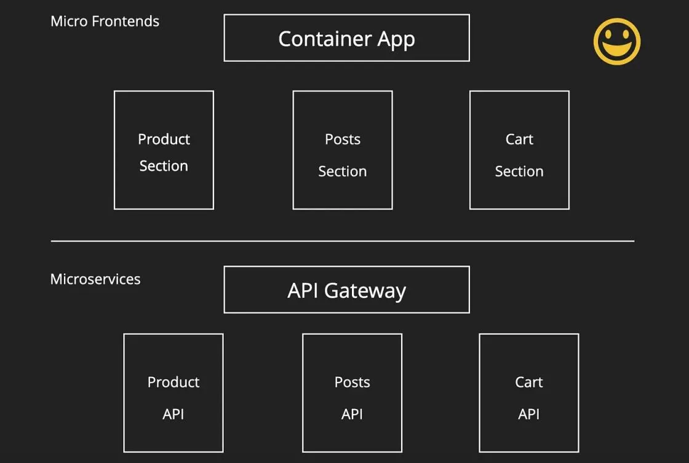
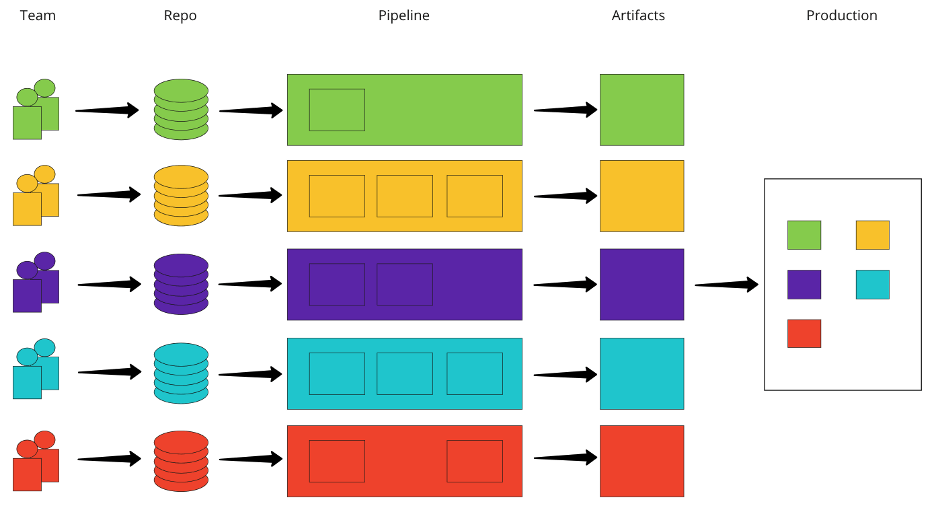

随着技术的不断发展和应用场景的不断变化，微前端架构也将不断演化和完善，成为更加成熟和稳定的前端架构模式，为开发者和企业带来更多的价值和机会。互联网应用的不断发展和迭代，传统的单体应用架构已经逐渐无法满足现代应用的需求。为了更好地适应快速变化的市场和业务需求，微服务和微前端架构成为了近年来的热门话题。

微前端架构通过将应用拆分为多个小型模块，实现了模块化的设计，允许团队成员使用不同的技术栈进行开发，避免了单一技术栈的限制。此外，微前端架构还可以实现独立部署、快速迭代和按需加载等技术，提高了应用的可靠性和可用性，同时也提升了用户的访问速度和体验。

### 什么是微前端架构

微前端架构是一种前端架构模式，旨在将一个大型的 Web 应用程序拆分为更小、更独立的部分，每个部分可以由不同的团队开发、部署和维护。在微前端架构中，每个子应用程序可以独立开发、构建、测试和部署，同时也可以独立于其他子应用程序进行扩展和缩放。

微前端架构的一个重要概念是应用程序的“微服务化”。这意味着将应用程序拆分为不同的功能模块，每个模块可以由不同的团队开发和维护。每个模块可以在自己的生命周期内独立开发和部署，并与其他模块进行通信和集成。

微前端架构的另一个重要概念是“集成”。在微前端架构中，不同的子应用程序可以通过共享组件、通信机制和协议来集成到一个整体中。这种集成可以是同步的，也可以是异步的。这种灵活性使得不同的子应用程序可以按照自己的节奏进行开发和部署，同时确保整个应用程序的一致性和可用性。

微前端架构的技术特性主要包括以下几个方面：

- 模块化：微前端架构通过将一个大型的应用拆分为多个小型的模块，实现了代码和功能的模块化，使得开发人员可以更加方便地进行模块化的开发、测试、部署和维护。

- 独立部署：每个微前端模块都可以独立部署，可以根据需要对不同的模块进行独立升级、回滚和扩容等操作，避免了对整个应用进行重启和部署的情况。

- 独立运行：每个微前端模块都可以独立运行，可以通过前端路由和页面嵌入等技术实现模块之间的相互调用和通信，同时也避免了模块之间的相互影响。

- 技术栈无关性：微前端架构可以将不同的技术栈进行集成，允许使用不同的编程语言和框架进行开发，方便团队成员使用自己熟悉的技术栈进行开发。

- 动态加载：微前端架构通过动态加载技术实现按需加载，可以将代码和资源进行动态加载，避免了页面加载速度慢和资源浪费的问题。

- 数据共享：微前端架构可以通过共享数据、状态和事件等技术实现模块之间的数据共享和通信，避免了不同模块之间数据不一致的问题。

- 可维护性：微前端架构的模块化设计和独立部署等特性，使得开发和维护变得更加简单和容易，方便进行代码的维护、升级和扩展等操作。

### 小程序容器技术

小程序容器技术可以看作是微前端架构的一种实现方式，因为它也是将一个大型的应用拆分为多个小型的模块，每个模块可以独立开发、部署和维护。小程序容器技术通过在主程序中引入小程序容器，实现将不同的小程序模块嵌入到主程序中的功能。

与传统的微前端架构不同的是，小程序容器技术更加注重模块之间的隔离性和安全性，每个小程序模块在容器中运行时，拥有自己的代码、样式和数据等资源，避免了模块之间的相互干扰。市面上一些比较知名的小程序容器技术产品包括：微信、支付宝、百度、抖音小程序等，他们都是以完善大社交平台自有小程序生态的技术底座，能提供第三方进行私有化部署的有：FinClip、mPaaS 等产品。

因此，尽管小程序容器技术有其独特的特点，但它仍然可以被视为微前端架构的一种实现方式，旨在帮助开发者实现应用的模块化、可维护性和可扩展性。

### 小程序容器技术的业务价值

- 高效协作：在大型应用开发中，不同的团队或开发者负责不同的模块，以小程序容器技术作为技术底座，可以将应用拆分为多个小型模块，使得团队成员可以更加高效地协作开发，避免了代码冲突和代码复杂度过高的问题。

- 独立部署：模块化设计使得每个模块可以独立部署、升级和扩容，避免了整个应用的停机和维护时间，保证了应用的高可用性和可靠性。

- 快速迭代：可以将应用拆分为多个小型模块，使得每个模块可以独立开发和测试，可以更加快速地进行应用的迭代和更新，提高了应用的开发效率和用户体验。

- 技术栈无关性：可以将不同的技术栈进行集成，允许使用不同的编程语言和框架进行开发，方便团队成员使用自己熟悉的技术栈进行开发，提高了团队开发的效率和灵活性。

- 用户体验提升：可以实现按需加载和动态加载等技术，避免了页面加载速度慢和资源浪费的问题，提高了用户的访问速度和体验。

- 代码复用：可以将不同的模块进行共享和组合，避免了重复编写代码和重复设计的问题，提高了代码的复用性和可维护性。

​ 总的来说，微前端架构（尤其是小程序容器技术）在现代应用开发中具有不可忽视的价值。它不仅能够提高开发效率和用户体验，还能够改善团队协作和代码复用率。

但是，微前端架构也面临一些挑战，比如如何实现模块化设计、如何管理依赖关系等问题。因此，在实际应用过程中，我们需要充分考虑到业务需求、技术栈、团队规模等因素，综合选择合适的微前端架构方案。微前端架构作为前端开发的新兴架构模式，不仅可以提高开发效率、迭代速度和用户体验，还可以提高团队的协作效率和代码复用率，具有很高的业务价值。
