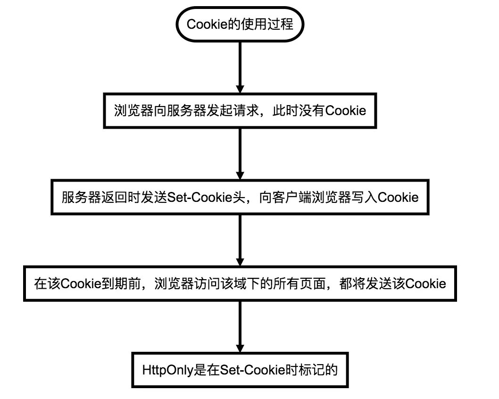

本文将从以下几种安全问题展开介绍:

- XSS 攻击
- CSRF 攻击
- SQL 注入
- XXE 漏洞
- JSON 劫持
- XST 攻击
- 暴力破解
- 信息泄露
- 其他漏洞

### 1. XSS 攻击

XSS 攻击全称跨站脚本攻击（Cross-Site Scripting），为区别 CSS，在安全领域叫做 XSS。攻击者通过在目标网站上注入恶意脚本并运行，获取用户的敏感信息如 Cookie、SessionID 等，影响网站与用户数据安全。

开始这种攻击的案例是跨域的，所以叫做“跨站脚本”。但是发展到今天，由于 JS 的强大以及网站前端应用的复杂化，是否跨域已经不再重要。但由于历史原因，XSS 这个名字却一直保留下来。
本质是恶意代码未经过滤，与网站正常的代码混在一起，浏览器无法分辨哪些脚本是可信的，导致恶意脚本执行。

**XSS 攻击要素**

- 攻击者提交恶意代码
- 浏览器执行恶意代码

**XSS 攻击分类**

| 类型       | 存储区                  | 插入点  |
| ---------- | ----------------------- | ------- |
| 反射型 XSS | URL                     | HTML    |
| 存储型 XSS | 后端数据库              | HTML    |
| DOM 型 XSS | 后端数据库/前端存储/URL | 前端 JS |

**反射型 XSS 攻击**

反射型 XSS 只是把用户输入的数据“反射”给浏览器，攻击者往往需要诱使用户操作一个恶意链接，才能攻击成功。反射型 XSS 也叫做“非持久型 XSS”（Non-persistent XSS）

**存储型 XSS 攻击**

存储型 XSS 会把用户输入的数据“存储”在服务器端，这种 XSS 具有很强的稳定性

比较常见的一个场景就是，黑客写下一篇包含有恶意 JS 代码的博客文章，发表后，所有访问该博客文章的用户都会在他们的浏览器中执行这段恶意的 JS 代码。黑客把恶意的脚本保存到服务器端，所以这种 XSS 攻击就叫做“存储型 XSS”

存储型 XSS 通常也叫做“持久型 XSS”(Persistent XSS)

**DOM 型 XSS 攻击**

DOM 型 XSS 从效果上来说也是反射型 XSS，通过修改页面的 DOM 节点形成 XSS，称之为 DOM 型 XSS

实际上，这种类型的 XSS 并非按照“数据是否保存在服务器端”来划分，单独划分出来，是因为 DOM 型 XSS 的形成原因比较特别，发现它的安全专家专门提出了这种类型的 XSS。出于历史原因，也就把它单独作为一个分类了。

**XSS 攻击类型区别**

- 存储型 XSS 的恶意代码存在数据库里，反射型 XSS 的恶意代码存在 URL 里

- DOM 型 XSS 攻击中，取出和执行恶意代码由浏览器端完成，属于前端 JS 自身的安全漏洞，而其他两种 XSS 都属于服务端的安全漏洞

**XSS 攻击检测**

- 使用 XSS 攻击字符串手动检测 XSS 漏洞

- 使用扫描工具自动检测 XSS 漏洞 例如 Arachni、Mozilla HTTP Observatory、w3af 等

**XSS 攻击防御**

- 输入输出检查
- 避免内联事件
- 富文本类使用标签白名单
- 增加攻击难度，降低攻击后果

:::tip

- 增加验证码，防止脚本冒充用户提交危险操作
- 通过 CSP、输入长度配置、接口安全措施等方法

:::

- 主动检测发现

针对以上总结的 XSS 攻击的防御方法，我们再来针对 CSP 与 HttpOnly 进行进一步的了解与分析：

- CSP (Content Security Policy)

:::tip

- 禁止加载外域代码，防止复杂的攻击逻辑
- 禁止外域提交，网站被攻击后，用户的数据不会泄露到外域
- 禁止内联脚本执行
- 禁止未授权的脚本执行
- 合理使用上报可以及时发现 XSS，利于尽快修复问题

:::

- HttpOnly Cookie

:::tip

禁止 JS 读取敏感 Cookie，攻击者完成 XSS 注入后也无法窃取 Cookie

XSS 攻击带来的不光是 Cookie 劫持问题，还有窃取用户信息、模拟用户身份执行操作 攻击者利用 AJAX 构造 HTTP 请求，以用户身份完成的操作，就是在不知道用户 Cookie 的情况下进行的。

:::

### 2. CSRF攻击
CSRF（Cross-site request forgery）跨站请求伪造，攻击者盗用受害人身份，以受害人的名义发送恶意请求。
其本质是重要操作的所有参数都是可以被攻击者猜测到的，攻击者只有预测出URL的所有参数与参数值，才能成功地构造一个伪造的请求；反之，攻击者将无法攻击成功。

**CSRF攻击要素**

- 攻击一般发起在第三方网站，被攻击的网站无法防止攻击发生
- 攻击利用受害者在被攻击网站的登录凭证，冒充受害者提交操作，而不是直接窃取数据
- 整个过程攻击者并不能获取受害者登录凭证，只是冒用
- 跨站请求可以是图片URL、超链接、CORS、Form提交等

**CSRF攻击防御**

- 阻止不明外域的访问

:::tip

**同源检测**

- 如何判断请求是否来自外域？HTTP协议中，每一个异步请求都会携带两个Header，用于标记来源域名：Origin Header、Referer Header，这两个Header在浏览器发起请求时，大多数情况会自动带上，并且不能由前端自定义内容。服务器可以通过解析这两个Header中的域名，确定请求的来源域。

**Samesite Cookie**

- SameSite-cookies 是Google起草的一份草案来改进HTTP协议，就是为Set-Cookie响应头新增Samesite属性，用来标明这个Cookie是个“同站 Cookie”，同站Cookie只能作为第一方Cookie，不能作为第三方Cookie，Samesite 有两个属性值，分别是Strict和Lax：

> Samesite=Strict：严格模式，表明这个 Cookie 在任何情况下都不可能作为第三方 Cookie，绝无例外  
> Samesite=Lax：宽松模式

:::

- 提交时要求附加本域才能获取的信息

:::tip

**CSRF Token**

- 将CSRF Token输出到页面中
- 页面提交的请求携带这个Token
- 服务器验证Token是否正确

**双重Cookie验证**

- 用户访问网站页面时，向请求域名注入一个Cookie，前端向后端发起请求时，取出Cookie，添加到URL的参数中，后端接口验证Cookie中的字段与URL参数中的字段是否一致，不一致则拒绝。
- 优点：无需使用Session，适用面更广，易于实施。Token储存于客户端中，不会给服务器带来压力。相对于Token，实施成本更低，可以在前后端统一拦截校验，而不需要一个个接口和页面添加。
- 缺点：Cookie中增加了额外的字段；如果有其他漏洞（例如XSS），攻击者可以注入Cookie，那么该防御方式失效。难以做到子域名的隔离。为了确保Cookie传输安全，采用这种防御方式的最好确保用整站HTTPS的方式，如果还没切HTTPS的使用这种方式也会有风险。

:::

**CSRF测试**

- 设置浏览器代理
- 使用合法账户访问网站开始测试
- 通过CSRF修改并伪造请求
- 拿到结果如有漏洞进行修复

### 3. SQL注入

通过Web应用接口注入SQL语法，破坏原有SQL结构，达到攻击行为。
如果网站存在注入漏洞，相当于将数据库直接暴露在攻击者面前
根据注入位置及方式不同分分为POST注入、GET注入、cookie注入、盲注、延时注入、搜索注入、base64注入等

**SQL注入要素**

- 跳过账户权限验证达到越权
- 获取数据库关键信息从而进行脱库
- 特别情况下还可以修改数据库内容，如果数据库权限分配存在问题，攻击者可以通过SQL注入漏洞直接获取webshell或者服务器系统权限

**SQL注入防御**

- 数据校验

:::tip

- 检查数据格式
- 使用数据库特定的敏感字符转义函数把用户提交数据进行转义

:::

- 权限限制
- 日志处理

:::tip

数据库操作失败的时，尽量不将原始错误日志返回，如类型错误、字段不匹配等，把代码里的SQL语句暴露出来，以防止攻击者利用错误信息进行SQL注入

:::

### 4. XXE漏洞
XXE （XML External Entity）外部实体漏洞，当应用程序解析XML输入时，如果没有禁止外部实体的加载，导致可加载恶意外部文件和代码，造成任意文件读取、命令执行、内网端口扫描等攻击。只在能够接收XML格式参数的接口才会出现

**XXE漏洞防御**

- 禁用外部实体
- 过滤用户提交的XML数据

### 5. JSON劫持
JSON劫持（JSON Hijacking）是用于获取敏感数据的一种攻击方式，属于CSRF攻击的范畴

**JSON劫持防御**

- X-Requested-With标识
- 浏览器JSON数据识别
- 禁止JS执行JSON数据

### 6. XST攻击
XST攻击（cross-site tracing）当Web服务器启用TRACE时，提交的请求头会在服务器响应Body中完整返回，其中HTTP头很可能包括Session Token、Cookies或其它认证信息，攻击者可以利用漏洞获取用户信息

**XST攻击防御**

- 禁用HTTP TRACE方法

### 7. 暴力破解
弱密码（Weak Password）被他人猜到或被破解工具暴力破解

**暴力破解防御**

- 增加密码复杂度
- 限制尝试次数

### 8. 信息泄漏
Web服务器或应用程序没有正确处理一些特殊请求，泄露 敏感信息，如用户名、密码、源代码、服务器信息、配置信息等

**信息泄漏防御**

- 应用程序报错时，不对外产生调试信息
- 过滤用户提交的数据与特殊字符
- 保证源代码、服务器配置安全

### 9. 其他漏洞

- 目录遍历漏洞
- 命令执行漏洞
- 文件上传漏洞
- 业务漏洞
- 框架或应用漏洞

作者：前端知识库  
链接：https://juejin.cn/post/6844903872746504206  
来源：稀土掘金  
著作权归作者所有。商业转载请联系作者获得授权，非商业转载请注明出处。