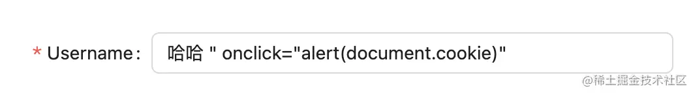

### XSS

XSS（Cross Site Scripting）叫做跨站脚本攻击，其攻击原理是利用登录用户的权限，在页面中注入一段脚本，来伪造用户进行请求后端。

**被攻击的场景**

- 有不安全表单输入的页面
- 不明链接的推广或弹窗

**用途**

- 盗号
- 篡改、盗取、删除企业信息数据
- 非法转账
- 利用宿主机对他人进行 DDos 攻击
- ...

**攻击类型**

- 反射型

XSS 脚本隐藏在连接中，欺骗用户去点击后，就会执行黑客的脚本；或者是利用博客网站的漏洞，在输入框中输入攻击脚本，并触发用户点击或被动访问。

- 存储型

XSS 脚本（例如：`<script>alert(document.cookie)</script>`）会存储在服务器上，比如在线博客等，每次从服务器读取数据后渲染时或者渲染后诱导用户点击时，就会执行黑客脚本。
一个存储+反射的例子如下图所示：



表单里填写以后保存，再次打开编辑时，input 里不但会有 value 字段，还会多一个 onckick 事件，每次点击输入框就会触发 alert。

- DOM 型

与反射性类似，但是会改变当前 HTML 的 DOM 树结构，比如脚本`let str = document.getElementById("text").value; document.getElementById("dom").innerHTML = "<a href='"+str+"'>你跳转到了我输入的地址啦！?</a>"`

**案例**

- 新浪微博 XSS 事件：用户被引诱点击一个不明链接，进入一个页面中，被自动关注了一个用户：hellosamy，并且自动转发私信给他人，最终导致该用户短时间内有了大量粉丝。
- 百度贴吧 XSS 事件：点击某贴的推广链接后会被自动转发，导致点击人员账号被封禁。
- 2011 新浪微博蠕虫事件

攻击方式是反射型：在微博访问路径下加了一段 `script: https://weibo.com/xx/xx/yy"><script src="攻击脚本地址"></scritp>`

- 2005 年 myspace 蠕虫事件

攻击方式是存储型：在文章中发表一篇文章，文章里藏了一些 js 代码，通过高超的手段绕过了安全屏蔽：

style 中使用 js：`<div style="width: expression(alert('xss))">` // IE 下适用

折行的片段绕过 javascript 关键字屏蔽：

```js
<a href='java
script: alert('xss')
'>
```

绕过引号混用屏蔽：

```js
String.fromCharCode(34); // "
```

用上面的代码表示一个双引号，从而绕过单双引号混用的校验。

4.绕过 innerHTML 的屏蔽：

```js
document.body["inner" + "HTML"] = "XSS";
```

**防御手段**

- 过滤字符

准备一个字符集进行过滤，缺点就是容易被像上边的案例那样被绕过。

- 开源库

例如 kses，提供一个大而全的白名单可供使用。

- 转义字符

将用户输入的任何内容，都作为普通转义字符串处理和存储。
例如 htmlspecialchars、StringEscapeUtils.unescapeHtml4 函数、前端模板渲染技术、JSX 等。

### CSRF

CSRF（Cross-site request forgery）叫做跨站请求伪造攻击。攻击者通过伪造用户的浏览器的请求，向访问一个用户自己曾经认证访问过的网站发送出去，使目标网站接收并误以为是用户的真实操作而去执行命令。被攻击的场景与 XSS 类似，只是一个需要注入脚本，一个伪装合法用户请求。

**攻击类型**

- GET 攻击

诱导用户点击不明链接，该链接会携带与用户登录系统同源的一个请求，进而达到伪装用户请求服务器的目的。

- POST 攻击

post 请求一般通过单纯的 url 无法达到目的，其参数放在 requestBody 里，而且还会有 cookie 等信息。
此时可以写一个 form 表单:

```html
<iframe name="frame" style="displat: none"></iframe>

<form target="frame" method="post" action="要攻击的服务地址url">
  <input name="action" value="createUser" />
  <input name="user" value="xss" />
  <input name="password" value="xxxsss" />
  <input name="email" value="xxoo@xss.com" />
  <input type="submit" id="submit" />
</form>

<script>
  document.querySelector("#submit").click();
</script>
```

然后在浏览器中设置一个不明链接，点击后就会访问这个 form。

**防御手段**

防御原理是利用伪造请求和合法请求的 url 不一样。

- 检测请求来源

服务器校验请求的 referer，来判断发送请求的域名是否为合法的来源。

- token 校验

token 一般是登录信息+时间戳随机合成的一长串唯一性字符串，别的网站中模拟的请求，是不存在这个 token 的。

### SQL 注入

通过把 SQL 命令注入到表单或输入框中，达到欺骗服务器来执行该 SQL 的目的。

**案例**

- 2013 年美国海军 Smart Web Move 应用被攻击
- 陆续有银行账户数据修改

**攻击方式**

- 登录注入

在不知道正确密码的前提下，执行如下 sql 是会查到正确的用户信息的：

```sql
select * from users where user='dudu' and pass='abc' or (1=1 and user='dudu') --"
```

因此，如果服务器对于密码校验只是简单的字符串拼接的话，只需要在密码框中输入：

```sql
abc' or (1=1 and user='dudu') --"
```

此时点击登录后，就能绕过密码校验了。

- 搜索框注入

一般的页面搜索都是模糊查询：

```sql
title like '%name%'
```

我们可以在搜索框中输入：

```sql
name'/**/or/**/1=1/**/#'
```

上述输入将后面所有的 sql 都注释掉，并且使查询条件失效。

**防御手段**

- 用户权限管理

对于关系到系统数据库创建、删除等高危操作，设立超级管理员，以避免普通用户入侵。

- SQL 语句使用参数传值
- 过滤 SQL 语句
- 定期漏洞扫描
- 对输入的内容进行多级验证

### 文件上传漏洞

指利用 Windows 文件命名规则，上传了可执行脚本文件，并通过脚本文件获得了执行服务器命令的能力。

**漏洞原因**

- windows 文件名中不能使用冒号、问号、星号、斜杠等特殊字符。
- 利用编程语言的漏洞，例如 php 的 move_uploaded_file 函数在移动文件时，会忽略非法字符及其之后的字符（例如：a.php:a.jpg --> a.php）

**攻击方式**

- 代理上传

通过一些中间工具（例如：fiddler）完成非法上传。

防御手段

:::tip

- 权限控制

在上传文件时，一般会新建一个 temp 文件夹，将该文件夹设置为 不可执行，这样上传上来的文件，即使后缀变了，也不会去执行。

- 不使用用户的文件名，而使用随机生成的名字

此时，a.php:a.jpg 文件会变成 xxxxx.jpg ，而不是 a.php

:::

### 项目实践

这里讲一下在具体开发业务中使用到的安全处理实践。

- XSS

:::tip

- 使用 dangerouslySetInnerHTML、InnerHTML 时，确保输入的是前端自己定义的不可修改的内容，严禁用户自定义输入。
- query 参数需经解析后以转移字符串显示
- 使用 Token 用户信息校验，直接禁止 Http 请求携带 Cookie
- 对于登录和安全认证的 Cookies 字段设置 HttpOnly
- 使用 XSS 库过滤入参

:::

- CSRF

:::tip

- 登陆验证使用 Token 请求头，前后端不传递 Cookie
- Form 表单提交使用 Post 提交
- 限制第三方请求，像第三方的库和图片都自行部署

:::

- SQL 注入

:::tip

- 使用数据库模型 Gorm 和 Sequelize 处理数据库语句
- 不用 Get 方法查询用户信息且接口必须增加鉴权
- 严格限定和校验数据库查询语句拼接的参数

:::

作者：小肚肚肚肚肚哦  
链接：https://juejin.cn/post/7216967809159774263  
来源：稀土掘金  
著作权归作者所有。商业转载请联系作者获得授权，非商业转载请注明出处。
