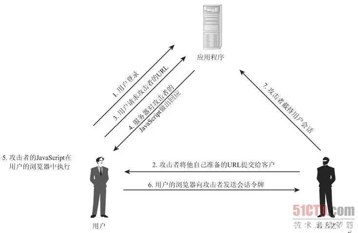

### XSS

跨站脚本攻击（Cross Site Script，XSS 攻击），通常指黑客通过“HTML 注入”篡改了网页，插入了恶意的脚本，从而在用户浏览网页时，控制用户浏览器的一种攻击。XSS 的本质是一种“HTML 注入”，用户的数据被当成了 HTML 代码一部分来执行，从而产生了新的语义。根据攻击脚本引入的位置，XSS 可以分为三类：

- 反射型 XSS

非持久化，将用户输入的数据反射给浏览器，经过后端，不经过数据库。黑客需要诱使用户“点击”一个恶意链接，才能攻击成功。



- 存储型 XSS

持久化，代码储存在数据库中，经过后端，经过数据库。如在个人信息或发表文章等地方，假如代码，如果没有过滤或过滤不严，那么这些代码将储存到数据库中，用户访问该页面的时候触发代码执行。比如一个表单，输入用户签名，前端直接把签名内容展示在页面上，如果没有进行 XSS 处理，假设输入：

```js
<script>alert(1)</script>
```

浏览器显示用户签名的时候，可能就会触发弹框。注意这里的脚本只是演示，在攻击时，脚本可能会执行各种动作，比如获取 Cookie 或所有本地存储并发送到某处，打开一个非法网址等等。

- DOM Based XSS

通过修改页面的 DOM 节点形成的 XSS，不经过后端。

比如前端直接通过获取 URL 参数渲染页面 DOM：

```js
http://localhost:8080/dvwa/vulnerabilities/xss_d/?default=English<script>alert(1)</script>
```

页面弹窗：


XSS 攻击挑战：xss-game.appspot.com

解法：https://gist.github.com/pbssubhash/2f99644a4f24e8fe6b3e

防御方式

一般使用对 HTML 字符编码转义来防范 XSS，比如：

```js
function HTMLEncode(str) {
  let s;
  if (str.length === 0) return "";
  s = str.replace(/&/g, "&gt;");
  s = s.replace(/</g, "&lt;");
  s = s.replace(/>/g, "&gt;");
  s = s.replace(/ /g, "&nbsp;");
  s = s.replace(/'/g, "'");
  s = s.replace(/"/g, "&quot;");
  s = s.replace(/\n/g, "<br>");
  return s;
}

function HTMLDecode(str) {
  let s;
  if (str.length === 0) return "";
  s = str.replace(/&gt;/g, "&");
  s = s.replace(/&lt;/g, "<");
  s = s.replace(/&gt;/g, ">");
  s = s.replace(/&nbsp;/g, " ");
  s = s.replace(/'/g, "'");
  s = s.replace(/&quot;/g, '"');
  s = s.replace(/<br>/g, "\n");
  return s;
}
```

但是绕过过滤的方式有很多，比如：

data 协议执行 javascript：

```
<a href=data:text/html;base64,PHNjcmlwdD5hbGVydCgzKTwvc2NyaXB0Pg==>
```

Jsfuck：

```
[][(![]+[])[+[]]+([![]]+[][[]])[+!+[]+[+[]]]+(![]+[])[!+[]+!+[]]+(!![]+[])[+[]]+(!![]+[])[!+[]+!+[]+!+[]]+(!![]+[])[+!+[]]][([][(![]+[])[+[]]+([![]]+[][[]])[+!+[]+[+[]]]+(![]+[])[!+[]+!+[]]+(!![]+[])[+[]]+(!![]+[])[!+[]+!+[]+!+[]]+(!![]+[])[+!+[]]]+[])[!+[]+!+[]+!+[]]+(!![]+[][(![]+[])[+[]]+([![]]+[][[]])[+!+[]+[+[]]]+(![]+[])[!+[]+!+[]]+(!![]+[])[+[]]+(!![]+[])[!+[]+!+[]+!+[]]+(!![]+[])[+!+[]]])[+!+[]+[+[]]]+([][[]]+[])[+!+[]]+(![]+[])[!+[]+!+[]+!+[]]+(!![]+[])[+[]]+(!![]+[])[+!+[]]+([][[]]+[])[+[]]+([][(![]+[])[+[]]+([![]]+[][[]])[+!+[]+[+[]]]+(![]+[])[!+[]+!+[]]+(!![]+[])[+[]]+(!![]+[])[!+[]+!+[]+!+[]]+(!![]+[])[+!+[]]]+[])[!+[]+!+[]+!+[]]+(!![]+[])[+[]]+(!![]+[][(![]+[])[+[]]+([![]]+[][[]])[+!+[]+[+[]]]+(![]+[])[!+[]+!+[]]+(!![]+[])[+[]]+(!![]+[])[!+[]+!+[]+!+[]]+(!![]+[])[+!+[]]])[+!+[]+[+[]]]+(!![]+[])[+!+[]]]((![]+[])[+!+[]]+(![]+[])[!+[]+!+[]]+(!![]+[])[!+[]+!+[]+!+[]]+(!![]+[])[+!+[]]+(!![]+[])[+[]]+(![]+[][(![]+[])[+[]]+([![]]+[][[]])[+!+[]+[+[]]]+(![]+[])[!+[]+!+[]]+(!![]+[])[+[]]+(!![]+[])[!+[]+!+[]+!+[]]+(!![]+[])[+!+[]]])[!+[]+!+[]+[+[]]]+[+!+[]]+(!![]+[][(![]+[])[+[]]+([![]]+[][[]])[+!+[]+[+[]]]+(![]+[])[!+[]+!+[]]+(!![]+[])[+[]]+(!![]+[])[!+[]+!+[]+!+[]]+(!![]+[])[+!+[]]])[!+[]+!+[]+[+[]]])()

```

建议使用成熟的库来防范，比如：https://github.com/leizongmin/js-xss

保护好用户的 Cookie，加上 HttpOnly 属性，加上了这个属性的 Cookie 字段，js 是无法进行读写的。

前后端一定都要过滤，在界面显示用户输入的内容时要谨慎。

### SQL 注入

SQL 注入就是指在输入的字符串中注入 SQL 语句，如果应用相信用户的输入而对输入的字符串没进行任何的过滤处理，那么这些注入进去的 SQL 语句就会被数据库误认为是正常的 SQL 语句而被执行。

比如后端代码：

```
$un = @$_POST['un'];
$pw = @$_POST['pw'];

// ...

$sql = "select * from user where un='$un' and pw='$pw'";
```

前端输入时，我们将 un 赋为 admin，pw 赋为' or '1'='1。则整个 SQL 语句会变为：

```
select * from user where un='admin' and pw='' or '1'='1'
```

就成功绕过了身份验证。

### CSRF

CSRF（Cross-site request forgery 跨站请求伪造，也被称为“One Click Attack”或者 Session Riding，通常缩写为 CSRF 或者 XSRF，是一种对网站的恶意利用。XSS 利用站点内的信任用户，而 CSRF 则通过伪装来自受信任用户的请求来利用受信任的网站。


例如：

一个银行站点存在一个 CSRF 漏洞，用户 A 转账给 B 用户 2000 元，执行转账操作后会对银行发送一次请求：`www.bank.com/money?use..…`，然后 A 用户就会把自己的 2000 元转到 B 的账户下。在发送这个请求给银行服务器时，服务器首先会验证这个请求是否为一个合法的 session，并且用户 A 确认登陆才可以验证通过。

如果此时有一个恶意用户 C 想把 A 用户的钱转到自己的账户下，那么他可以构造 `www.bank.com/money?use..`… 这个请求，但是这个请求必须有 A 用户发出才可以生效，此时恶意用户 C 可以搭建一个自己的网站，在网站中写入如下代码：``之后诱导 A 用户访问自己的网站，当 A 访问这个网站时，这个网站就会把 img 标签里的 URL 发给银行服务器，而此时除了这个请求以外，还会把 A 用户的 cookie 一起发到服务器，如果此时 A 用户的浏览器与银行的 session 没有过期，那么就会在 A 用户毫不知情的情况下执行转账给 C 的操作。

CSRF​ 一般会用于以下场景：

1、对网站管理员进行攻击：诱骗管理员点击存在漏洞的链接，执行增加删除网站管理账户的操作，从而进行下一步渗透得到网站 shell 权限。

[Discuz! X2.5 / X3 / X3.1 可 CSRF 删管理员账号](http://wooyun.jozxing.cc/static/bugs/wooyun-2014-054655.html)

发帖插入 Discuz! 代码，其中修改 uidarray 可以删除多个指定用户：

```
[img]admin.php?frame=no&action=members&operation=clean&submit=1&uidarray=1&confirmed=yes[/img]
```

2、修改受害网站上的用户账户和数据：对账户密码进行重置，改邮箱绑定，修改个人资料、个人设置，删除用户发布的文章帖子等。

[美丽说网 CSRF 重置任意用户帐号密码(已经拿到商家帐号证明)](http://wooyun.jozxing.cc/static/bugs/wooyun-2015-0114338.html)

3、账户劫持：修改密码处没有验证原有密码，无 token 验证，发送一个修改密码的链接即可。或者发送一个修改绑定邮箱的链接，再进行密码重置。

[微信公众平台 CSRF 可导致公众账号被劫持](http://wooyun.jozxing.cc/static/bugs/wooyun-2013-021151.html)

4、传播 CSRF 蠕虫进行大规模攻击：此类攻击发生的场景一般在 SNS 站点，批量关注、发微博、改个人资料处。

[新浪微博 CSRF 之点我链接发微博（可蠕虫）](http://wooyun.jozxing.cc/static/bugs/wooyun-2015-0164067.html)

5、利用 csrf 进行拖库。

[Discuz 可 CSRF 脱裤](http://wooyun.jozxing.cc/static/bugs/wooyun-2014-064886.html)

6、利用其他漏洞进行组合拳攻击。

**防御方式**

1、使用验证码：

CSRF 攻击一般都是在受害者不知情的情况下进行发起的，使用验证码可以有效的防止攻击，但是每次请求都要输入验证码会影响用户体验，所以通常只在用户登录注册，还有一些特定业务场景下使用，比如银行转账。如何使用验证码要根据业务和场景来决定。

2、验证 http Referer：

http 头中的 referer 字段记录了请求来源地址，比如从 www.test.com 点击链接到 m.test.com 之后，那么 referer 就是 www.test.com 这个地址。攻击者在对受害者进行攻击的时候，是在攻击者自己的服务器上构建自己的恶意脚本，诱骗受害者点击，所以此时的 referer 值就是攻击者自己的 URL 地址。通过以上可知，CSRF 攻击都是跨域发起的，所以在服务端针对 referer 字段验证是否属于安全可靠的域名，可在一定程度上有效防御此类攻击。

但是此类方法并非万无一失，在低版本存在漏洞的浏览器中，黑客可以篡改 referer 值。另一种情况是 CSRF 结合 XSS 进行攻击，此时就不需要跨域发起，也可以绕过 referer 验证。

3、使用 token

当用户第一次进行登录的时候，客户端会通过用户名和密码去请求服务器登录，服务端在收到请求后会验证客户端传来的用户名和密码，如果验证通过，服务器就会签发一个 token 发给客户端，并且将 token 放到 session 或者报文中，客户端收到 token 后存储到本地，以后客户端只要每次请求服务器就要带上 token，经过服务器验证通过后才会返回响应数据，否则报错。

CSRF 攻击成功的前提条件是攻击者可以完全伪造出受害者的所有请求，而且请求中的验证信息都在 cookie 中，黑客只要使用用户的 cookie 通过安全验证就可以完成攻击。了解了这些之后，想要防止 CSRF 攻击，就要在 http 请求中放置黑客不可以伪造的信息，而且该信息不可以存在于 cookie 中，否则就无效。而 token 令牌最大的特点就是随机性，不可预测，并且不存在于 cookie 当中。

最后注意一点，如果在同域下存在 XSS 漏洞，那么这种使用 token 的防御将形同虚设。

### SSRF

很多 Web 应用都提供了从其他服务器上获取数据的功能。使用用户指定的 URL，web 应用可以获取图片，下载文件，读取文件内容等。这个功能如果被恶意使用，可以利用存在缺陷的 Web 应用作为代理，攻击远程和本地服务器。这种形式的攻击成为服务器请求伪造（SSRF，Server-Side Request Forgery）。比如下列代码：

```
<?php
$url = @$_GET['url'];
if($url) {
    $ch = curl_init();
    curl_setopt($ch, CURLOPT_URL, $url);
    curl_setopt($ch, CURLOPT_RETURNTRANSFER, 1);
    curl_setopt($ch, CURLOPT_HEADER, 0);
    curl_setopt($ch, CURLOPT_SSL_VERIFYPEER, false);
    curl_setopt($ch, CURLOPT_SSL_VERIFYHOST, false);
    $co = curl_exec($ch);
    curl_close($ch);
    echo $co;
}

```

这段代码从 URL 中读取 url 参数，之后访问 url 参数所指向的 URL 资源，最后把资源显示在页面上。

我们访问 `localhost/ssrf.php?url=www.baidu.com：`


这个漏洞还可以用于访问本地的资源，我们再访问 file:///C:/Windows/win.ini


以下业务场景容易出现这种漏洞：

- 应用从用户指定的 URL 获取图片，然后把它用一个随机名称保存在硬盘上，并展示给用户。
- 应用获取用户指定 URL 的数据（文件或者 HTML）。这个函数会使用 socket 和 服务器建立 TCP 连接，传输原始数据。
- 应用根据用户提供的 URL，抓取用户的 Web 站点，并且自动生成移动 Wap 站。
- 应用提供测速功能，能够根据用户提供的 URL，访问目标站点，以获取其在对应经纬度的访问速度。

比如：[有道翻译某处 SSRF 可通网易内网](http://wooyun.jozxing.cc/static/bugs/wooyun-2016-0198176.html)

防御方式

- 过滤返回信息，验证远程服务器对请求的响应，是比较容易的方法。如果 Web 应用获取某种类型的文件，那么可以在把返回结果展示给用户之前先验证返回信息是否符合标准。

- 统一错误信息，避免用户根据错误信息来判断远程服务器端口状态。
- 限制请求的端口为 HTTP 常用端口，比如 80、443、8080、8090。
- 黑名单内网 IP，避免应用被用来获取内网数据，攻击内网。
- 禁用不需要的协议。仅仅允许 HTTP 和 HTTPS 请求。可以防止类似于 file://、gopher://和 ftp://等引起的问题。

### 劫持

很多的时候，我们的网站不是直接就访问到我们的服务器上的，中间会经过很多层代理，如果在某一个环节，数据被中间代理层的劫持者所截获，他们就能获取到使用你网站的用户的密码等保密数据。

**HTTP 劫持**

HTTP 劫持是指，在用户浏览器与访问的目的服务器之间所建立的网络数据传输通道中从网关或防火墙层上监视特定数据信息，当满足一定的条件时，就会在正常的数据包中插入或修改成为攻击者设计的网络数据包，目的是让用户浏览器解释“错误”的数据，或者以弹出新窗口的形式在使用者浏览器界面上展示宣传性广告或者直接显示某块其他的内容。

这种情况下一般用户请求源网站的 IP 地址及网站加载的内容和脚本都是正确的，但是在网站内容请求返回的过程中，可能被 ISP ( Internet Service Provider，互联网服务提供商）劫持修改，最终在浏览器页面上添加显示一些广告等内容信息。

也有可能是我们在各种饭馆里面，连一些奇奇怪怪的 wifi，如果这个 wifi 是黑客所建立的热点 wifi，那么黑客就可以截获该用户收发的所有数据，之前 315 也演示过这个场景。对于这些情况，网站开发者常常就无法通过修改网站代码程序等手段来进行防范了。请求劫持唯一可行的预防方法就是尽量使用 HTTPS 协议来访问目标网站。还有就是尽量不蹭网。

**DNS 劫持**

DNS 劫持通常是指攻击者劫持了 DNS 服务器，通过某些手段取得某域名的解析记录控制权，进而修改此域名的解析结果，导致用户对该域名地址的访问由原 IP 地址转入到修改后的指定 IP 地址的现象，其结果就是让正确的网址不能解析或被解析指向另一网站 IP，实现获取用户资料或者破坏原有网站正常服务的目的。DNS 劫持一般通过篡改 DNS 服务器上的域名解析记录，来返回给用户一个错误的 DNS 查询结果实现。


DNS 劫持也没有好的解决方法，尽量外出不蹭网，网站尽量使用 HTTPS 协议。

**点击劫持**

点击劫持（ClickJacking）是一种视觉上的欺骗手段。攻击者使用一个透明的、不可见的 iframe，覆盖在一个网页上，然后诱使用户在网页上进行操作，此时用户将在不知情的情况下点击透明的 iframe 页面。通过调整 iframe 页面的位置，可以诱使用户恰好点击在 iframe 页面的一些功能性按钮上。

点击劫持的危害在于，攻击利用了受害者的用户身份，在其不知情的情况下进行一些操作。如果只是迫使用户关注某个微博账号的话，看上去仿佛还可以承受，但是如果是删除某个重要文件记录，或者窃取敏感信息，那么造成的危害可就难以承受了。

点击劫持的防范主要是设置 HTTP 请求头(X-Frame-Options)，X-Frame-Options HTTP 响应头，可以指示浏览器是否应该加载一个 iframe 中的页面。网站可以通过设置 X-Frame-Options 阻止站点内的页面被其他页面嵌入从而防止点击劫持。

通过写 JavaScript 来禁止 iframe 嵌套也可以，不过很容易绕过：

```
  //------------------------------------
  // 防止网站被其他网页作为iframe嵌入
  //------------------------------------

  if (self != top) {
    top.location.href = self.location.href;
  }

```

### 代码执行

由于开发人员编写源码时，没有针对代码中可执行的特殊函数入口做过滤，导致客户端可以提交恶意构造语句，并交由服务端执行。命令注入攻击中，Web 服务器没有过滤类似 system、eval 和 exec 等函数，是该漏洞攻击成功的主要原因。

比如代码：

```js
<?php
// code-exe.php:
$code=@$_GET['code'];//http://localhost/subject/code-exe.php?code=
echo "<center>Payload:".$code."<br/>Result:</center>
eval($code);

```

访问 `http://localhost/code-exe.php...` 就可以看到 php info 了。

### 不安全的第三方依赖

据统计一个应用有将近 80%的代码其实是来自于第三方组件、依赖的类库等，而应用自身的代码其实只占了 20%左右。无论是后端服务器应用还是前端应用开发，绝大多数时候我们都是在借助开发框架和各种类库进行快速开发。

举个例子，jQuery 就存在多个已知安全漏洞，例如 jQuery issue 2432，使得应用存在被 XSS 攻击的可能。而 Node.js 也有一些已知的安全漏洞，比如 CVE-2017-11499，可能导致前端应用受到 DoS 攻击。另外，对于前端应用而言，除开使用到的前端开发框架之外，通常都还会依赖不少 Node 组件包，它们可能也有安全漏洞。

也可能有人恶意编写有漏洞的 JS 文件，并且把它放到 CDN 上给别人用，所有使用它的站点都会受到影响。

NPM 就有过这样的例子：软件包 getcookies 潜藏后门程序，而 express-cookies 和 http-fetch-cookies 依赖于 getcookies，而 mailparser 依赖于 http-fetch-cookies。

### 弱口令

弱口令没有严格和准确的定义，通常认为容易被别人（它们有可能对你很了解）猜测或被破解工具破解的口令均为弱口令。弱口令指的是仅包含简单数字和字母的口令，例如"123"、"abc"等，因为这样的口令很容易被别人破解。

**普通型**

普通型弱口令就是常见的密码，比如，有人特地整理了常用的弱口令（Top 100）：

```
123456 a123456 123456a 5201314 111111 woaini1314 qq123456 123123 000000 1qaz2wsx 1q2w3e4r
qwe123 7758521 123qwe a123123 123456aa woaini520 woaini 100200 1314520 woaini123 123321
q123456 123456789 123456789a 5211314 asd123 a123456789 z123456 asd123456 a5201314 aa123456
zhang123 aptx4869 123123a 1q2w3e4r5t 1qazxsw2 5201314a 1q2w3e aini1314 31415926 q1w2e3r4
123456qq woaini521 1234qwer a111111 520520 iloveyou abc123 110110 111111a 123456abc w123456
7758258 123qweasd 159753 qwer1234 a000000 qq123123 zxc123 123654 abc123456 123456q qq5201314
12345678 000000a 456852 as123456 1314521 112233 521521 qazwsx123 zxc123456 abcd1234 asdasd
666666 love1314 QAZ123 aaa123 q1w2e3 aaaaaa a123321 123000 11111111 12qwaszx 5845201314
s123456 nihao123 caonima123 zxcvbnm123 wang123 159357 1A2B3C4D asdasd123 584520 753951 147258
1123581321 110120 qq1314520

```

对于网站后台而言，一般为：

```
admin
manager
root
root123
tomcat
jboss
admin123
admin888
admin666
```

**条件型**

条件型弱口令就是和用户信息相关的密码，比如生日+手机号、姓名首字母+生日、爱人姓名首字母+生日+常用字母（520、1314 等）。黑客拿到用户的信息，根据密码心理学，社会工程学之类的，来猜测密码。我们看的很多影片，都是社会工程学，比如特工偷取工卡、伪造证件之类的，安全最大的漏洞其实是人。

**撞库型**

很多用户会在各个网站上使用同一个密码，黑客利用第三方已经泄露的用户数据库中的用户名、邮件地址或者手机号等去匹配明文密码，有一定概率命中。

这里可以查询是否被搞：haveibeenpwned.com/

之前很多知名的社工库都被搞了，大部分都在暗网交易。可以试试这个：publicdbhost.dmca.gripe/

查人：pipl.com

注册网站找回：www.zhaohuini.com/

**防御方式**

- 每个网站设置不同的密码，密码 12 位以上，不要和自己的个人信息相关。
- 银行取款密码不要和生日、身份证号之类相关。
- 千万不要在云存储中存储证件照片，特别是手持身份证照片。

### 文件上传

浏览器通过上传页面将文件储存到服务器中。一般这些上传页面都会有限制（比如限制格式为 jpg/gif/png 等等，或者限制文件大小）。漏洞页面大致分为两种，一种是不限制任何格式，随意上传，这种现在比较少了。另一种是限制 Content-type，虽然它限制了文件类型，但可以突破它。

**任意文件上传**
比如我们把一句话 `<?php @eval($_POST['a']) ?> `写入 1.php，然后把它上传到服务器。之后，尝试直接访问所上传的文件 xxx/upload/1.php。

**文件类型限制**

如果只是前端做了扩展名限制，可以通过接口工具绕过。如果后端加上了校验，这个校验必须很谨慎。黑客也有可能利用服务器的已知漏洞。比如之前 Nginx、Apache、IIS 都爆出过解析漏洞。

例如：假设存在漏洞的站点上有一张图片，URL 地址为：www.xxx.com/logo.jpg

我们正常访问时，Nginx 会把它当做非脚本，直接读取并传给客户端。但是如果我们这样访问：

`www.xxx.com/logo.jpg/a.php`

他就会把 logo.jpg 当做 PHP 文件来执行。或者是：

`www.xxx.com/logo.jpg%00.php`

也会导致图片执行，往图片里面加一句 `<?php @eval($_POST['a']) ?> `，post 参数 a 里的内容就会被执行。

### 越权

越权（或者说权限提升，Privilege Escalation）是指攻击者能够执行他本身没有资格执行的一些操作。简单讲，就是“超越了你你拥有的权限，干了你本来不可能干的事儿”。越权漏洞的成因主要是开发人员在对数据进行增、删、改、查时对客户端请求的数据过于信任而遗漏了权限的判定。越权漏洞和前端的关系略小，不过因为在互联网金融领域太常见，所以一起说下。


中国金融认证中心（CFCA）抽选和分析了 2017 年 113 个电子银行系统的渗透测试结果显示，发现的 306 个中高风险等级的安全漏洞中，与业务安全相关的漏洞占比最大，有 210 个，而传统渗透测试中常见的安全漏洞，如跨站脚本攻击、SQL 注入、任意文件上传、远程命令执行等 WEB 应用安全漏洞，在电子银行系统中存在的情况相对较少。我们的安全级别并不比电子银行系统高多少，所以上面的漏洞都应当注意。

通常情况下，我们使用一个 web 应用程序提供的功能时，流程是：登录—>提交请求—>验证权限—>数据库查询—>返回结果。如果在“验证权限”环节存在缺陷，那么便会导致越权。一种常见的存在越权的情形是：Web 应用程序的开发者安全意识不足，认为通过登录即可验证用户的身份，而对用户登录之后的操作不做进一步的权限验证，进而导致越权问题。比如：

1、通过隐藏 URL 实现访问控制：

有些应用程序仅通过 URL 实现访问控制。例如：使用管理员身份登录后可以看到后台管理页面的链接，但是以普通用户登录则看不到该链接。但是直接输入链接，比如 xx/admin/userlist 之类的，普通用户就可以访问管理页面。

2、直接对象引用：

例如，在一个网银系统中，用户可以使用以下 URL 查询账户信息：

`https://www.onlinebank.com/viewInfo.php?accountId=12345678`

其中 accountId 是用户自己的账户 ID。用户登录自己的账户后，该 URL 的链接会出现在用户账户页面中，用户点击即可跳转到账户信息页面。虽然其他用户无法看到这个链接，但是如果该网银系统的访问控制不完善，攻击者完全可以通过枚举 accountId 进而构造出 URL，然后越权查看他人的账户信息。

3、多阶段功能：

应用程序的一些功能通过几个阶段执行，并且在执行过程中向服务器依次提交多个请求。这种情况很常见，比如转账功能、找回密码功能等，需要先验证用户的身份，验证通过后才允许用户执行后续动作。多阶段功能本身并没有问题，但是如果开发者认为到达验证过程后续阶段的用户一定已经拥有了相关的权限，并在后续阶段执行操作时不再对用户提交的请求进行验证，那么就很有可能存在越权漏洞。攻击者完全有可能绕过前几阶段的验证阶段，直接执行后续的动作。

比如某网站在找回密码时做了很严格的验证，需要验证姓名、手机号、身份证号等信息，验证通过了才能修改密码。校验很严格，但是该网站的“找回密码”功能被设计成了两步（提交了两个请求报文）：第一步验证用户身份，这时提交第一个请求报文，验证成功之后，进入第二步；第二步才是真正的修改密码的动作，而修改密码的 POST 数据包有 3 个请求参数，分别是新密码、确认新密码以及账号值。问题就出在第二步，在执行修改密码的动作时，服务器并未验证被修改密码的账户是否是第一步中通过身份验证的账户，因此攻击者可以很容易的以自己的身份通过认证，然后修改第二步提交的报文，实现对任意账户的密码修改！常见的越权高发功能点有：根据订单号查订单、根据用户 ID 查看帐户信息、修改/找回密码等。

4、静态文件：

有些 Web 应用程序在用户访问动态页面时会执行相应的访问控制检查，以确定用户是否拥有执行相关操作所需的权限。但是，用户仍然会提交对静态资源的访问请求，如下载网站中的 word、excel、pdf 文档等。这些文档都是完全静态的资源，其内容直接由 Web 服务器返回，它并不在服务器上运行。因此，静态资源自身并不能执行任何检查以确认用户的访问权限。如果这些静态资源没有得到有效的保护，那么任何知晓 URL 命名规则的人都可以越权访问这些静态资源。比如 Google hacking 一下：


防御方式

实现应用程序的完善的访问控制不是件容易的事，因此越权漏洞防不胜防。对于开发者而言，一定要有安全意识，时刻保持警惕。比如：

- 永远不要相信来自客户端（用户）的输入。
- 执行关键操作前必须验证用户身份，多阶段功能的每一步都要验证用户身份。
- 对于直接对象引用，加密资源 ID，以防止攻击者对 ID 进行枚举。
- 在前端实现的验证并不可靠，前端可以验证用户的输入是否合规，在服务器端验证用户权限。

### 钓鱼

自己要去国外了房子车子甩卖了，详情在我 QQ 空间里啦，之类的连接。打开之后发现一个 QQ 登录框，其实一看域名就知道不是 QQ，不过做得非常像 QQ 登录，不明就里的用户们，就真的把用户名和密码输入了进去，结果没登录到 QQ，用户名和密码却给人发过去了。

还有很多钓鱼短信常会伪装成银行发送的短信，一般都是警告用户的银行账户出现了安全问题，诱使用户点击短信中的链接地址来解决。钓鱼短信会链接到一个高仿的正规网站，这个高仿网站从表面上看不论是图标还是页面设计和官方网站一样，给用户造成一种假象，觉得这个网站没问题。接着就是要求用户提供尽可能多的个人信息。

钓鱼邮件是指黑客伪装成同事、合作伙伴、朋友、家人等用户信任的人，通过发送电子邮件的方式，诱使用户回复邮件、点击嵌入邮件正文的恶意链接或者打开邮件附件以植入木马或间谍程序，进而窃取用户敏感数据、个人银行账户和密码等信息，或者在设备上执行恶意代码实施进一步的网络攻击活动。

还有一种是鱼叉式钓鱼攻击，鱼叉式钓鱼攻击与其他类型的钓鱼式攻击的不同之处在于，鱼叉式钓鱼针对的是特定人员或特定公司的员工。网络犯罪分子会精心收集目标对象的信息，使”诱饵”更具诱惑力。精心制作的鱼叉式钓鱼电子邮件可能很难与合法的电子邮件区分开来。所以，鱼叉式钓鱼攻击更容易使目标上钩。以人力资源部为例。该部门员工会收到各种格式不一的大量简历，所以收来一份附件来源不明的电子邮件是很平常的事，不会引起怀疑。简历里如果再附上一些作品链接或者作品附件之类的，就很容易中招。

防御钓鱼攻击只能靠细心，别贪便宜，别轻信链接和附件，记忆常用域名。
