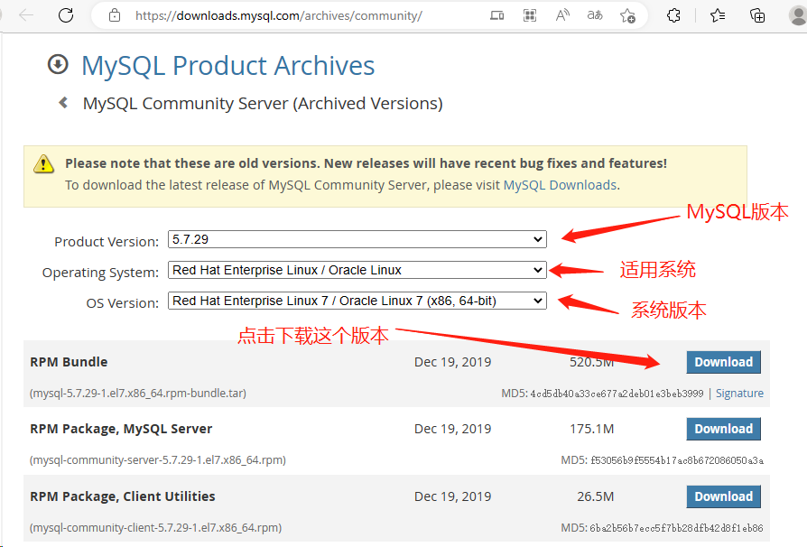
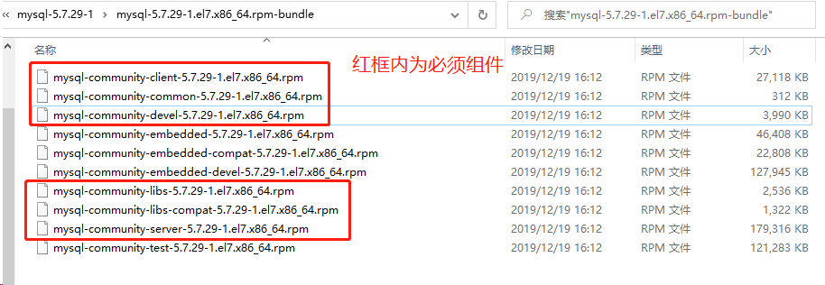
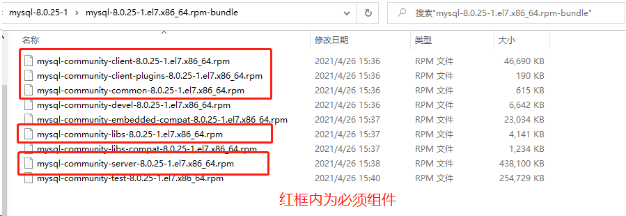
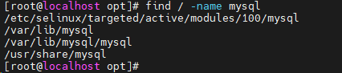
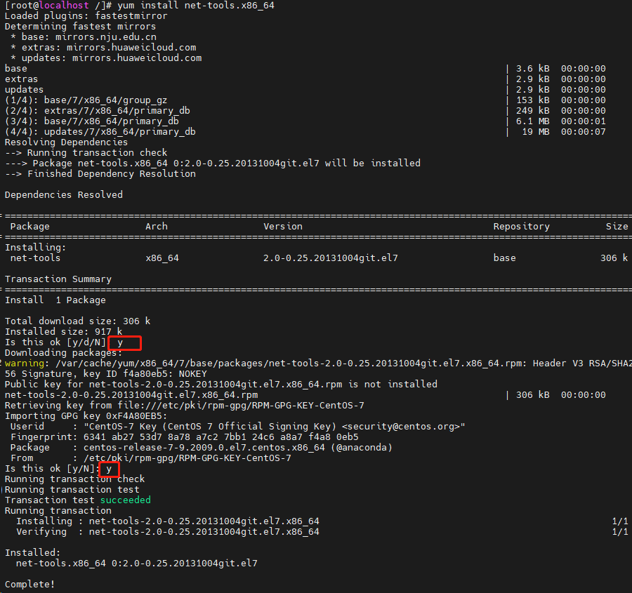
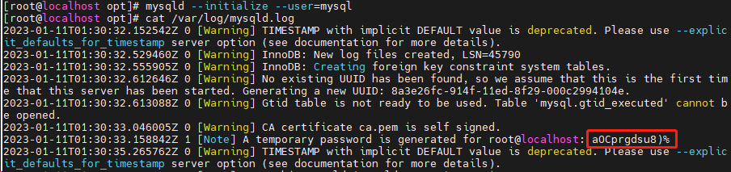
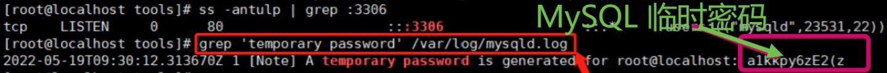
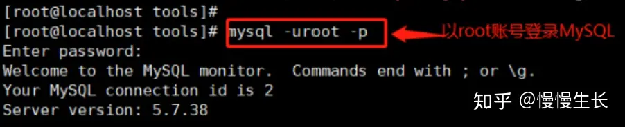
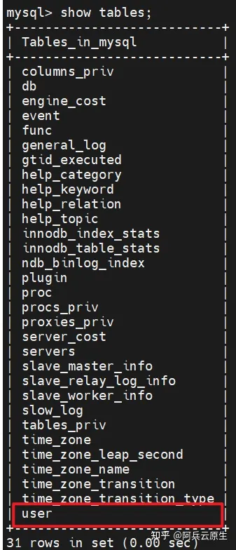
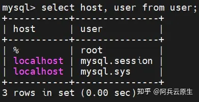

### 下载需要的 MySQL 版本

在官网查找自己需要的版本，我们这里选择 5.7 和 8.0 各一个

```
#官网
https://downloads.mysql.com/archives/community/
```



MySQL5.7/8.0 版本





### 检查系统内是否有 mysql

查询是否有 MySQL

```
rpm -qa | grep mysql
#如果有，删除掉
rpm -e --nodeps mysql的名称
```

```
# 查看MySQL服务是否启动，关闭
service mysql status
service mysql stop
```


```
# 查看当前 MySQL 状态
systemctl status mysqld.service

# 关闭 MySQL 服务
systemctl stop mysqld.service
```


卸载检查出来的已经安装的程序

```
yum remove mysql-xxx
```

务必卸载完全，反复执行`rpm -qa | grep -i mysql` 确认是否有残留

查找相关文件

```
find / -name mysql
```



删除上述命令找到的相关文件

```
rm -rf xxx
```

删除 my.cnf

```
rm -rf /etc/my.cnf
```

查是否自带 mariadb

```
rpm -qa | grep mariadb
#有就删除掉
rpm -e --nodeps mariadb-libs-5.5.56-2.el7.x86_64
```

### MySQL 安装

通过 `cd /usr/local/` 命令进入根目录下的 usr 目录下的 local 目录，这个目录是放一些本地的共享资源的。并且通过`mkdir mysql`命令在当前目录下创建一个名为 mysql 的目录

解压 mysql5.7 并指定目录/usr/local/mysql/

```
tar -xvf mysql-5.7.36-1.el7.x86_64.rpm-bundle.tar  -C  /usr/local/mysql/
```

安装之前先执行命令，清除之前安装过的依赖，以免安装过程中报错

```
yum remove mysql-libs
```

查看是否存在 libaio

```
rpm -qa | grep libaio
```

查看是否存在 net-tools

```
rpm -qa | grep net-tools
#如不存在需要安装
yum install net-tools.x86_64
```



安装依赖库

```
yum install -y libaio
yum install -y net-tools
yum -y install perl perl-devel
yum -y install numactl
```

进入解压目录/usr/local/mysql/，按顺序安装 mysql

MySQL5.0 和 MySQL8.0 安装过程略有不同

```

#MySQL5.0安装顺序，不可打乱必须按照此顺序执行
rpm -ivh mysql-community-common-5.7.29-1.el7.x86_64.rpm
rpm -ivh mysql-community-libs-5.7.29-1.el7.x86_64.rpm
rpm -ivh mysql-community-libs-compat-5.7.29-1.el7.x86_64.rpm
rpm -ivh mysql-community-client-5.7.29-1.el7.x86_64.rpm
rpm -ivh mysql-community-server-5.7.29-1.el7.x86_64.rpm
rpm -ivh mysql-community-devel-5.7.29-1.el7.x86_64.rpm
```

```
#MySQL8.0安装顺序，不可打乱必须按照此顺序执行
rpm -ivh mysql-community-common-8.0.25-1.el7.x86_64.rpm
rpm -ivh mysql-community-client-plugins-8.0.25-1.el7.x86_64.rpm
rpm -ivh mysql-community-libs-8.0.25-1.el7.x86_64.rpm
rpm -ivh mysql-community-client-8.0.25-1.el7.x86_64.rpm
rpm -ivh mysql-community-server-8.0.25-1.el7.x86_64.rpm
```

查看是否安装成功

```
#执行如下命令，如果有返回版本信息表示安装成功
mysql --version
#或着
mysqladmin --version
```

安装完成后别启动 ！别启动 ！别启动 ！
先配置/etc/my.cnf设置表名大小写不敏感

```
# 在[mysqld]组下添加如下配置
lower_case_table_names=1
```

### 初始化登录

MySQL 初始化

```
mysqld --initialize --user=mysql
```

注意如果需要数据库支持忽略大小写则写成 `mysqld --initialize --lower-case-table-names=1` 因为 Mysql8.0 只支持在初始化时做修改，否则后期只能重新初始化！

```
chown mysql:mysql /var/lib/mysql -R
```

查看临时密码 root@localhost：后面但就是临时密码

```
cat /var/log/mysqld.log
```



启动 MySQL，查看状态

```
#启动：
systemctl start mysqld.service
#关闭：
systemctl stop mysqld.service
#重启：
systemctl restart mysqld.service
#查看状态：
systemctl status mysqld.service
#检查是否自启：
systemctl list-unit-files|grep mysqld.service
#开机自启：
systemctl enable mysqld.service
#关闭开机自启：
systemctl disable mysqld.service
#查看进程：
ps -ef | grep -i mysql
```

获取 MySQL 默认登录密码，登录 MySQL，并修改默认的登录密码（MySQL 临时密码）

```
grep 'temporary password' /var/log/mysqld.log
```



输入下面命令，接着输入默认登录密码，就能以 root 帐号登录 MySQL

命令：`mysql -u root -p` # -u 表示用户名 -p 表示密码



在创建数据库或数据表之前，要修改 root 用户的登录密码。

修改 root 用户的登录密码

```
ALTER USER 'root'@'localhost' IDENTIFIED BY '新密码' PASSWORD EXPIRE NEVER;

#刷新修该后的权限
flush privileges;
```

修改设置密码的验证规则

```
set global validate_password.policy=0;
set global validate_password.length=1;
```

:::tip
关于 mysql 密码策略相关参数；
1）validate_password.length 固定密码的总长度；
2）validate_password.dictionary_file 指定密码验证的文件路径；
3）validate_password_mixed_case_count 整个密码中至少要包含大/小写字母的总个数；
4）validate_password_number_count 整个密码中至少要包含阿拉伯数字的个数；
5）validate_password_policy 指定密码的强度验证等级，默认为 MEDIUM；
关于 validate_password_policy 的取值：
0/LOW：只验证长度；
1/MEDIUM：验证长度、数字、大小写、特殊字符；
2/STRONG：验证长度、数字、大小写、特殊字符、字典文件；
6）validate_password_special_char_count 整个密码中至少要包含特殊字符的个数；
:::


### 设置可远程访问

选择 mysql 数据库，并查询一下当前的 user 表

```
use mysql;
show tables;
select host, user from user;
```



更新 host 字段

```
update user set host="%" where user = "root";
flush privileges;
```

更新完毕后，我们再查询一次 user 表，就可以看到我们的更新的效果了

```
select host, user from user;
```



设置 mysql 可以被远程连接

```
GRANT ALL PRIVILEGES ON *.* TO 'root'@'%' WITH GRANT OPTION;


# 开启权限，让权限立即生效
flush privileges;
```

### 开放端口

```
#如果没有关闭防火墙，到了这一步一定要记得开放端口
firewall-cmd --zone=public --add-port=3306/tcp --permanent
firewall-cmd --reload
```

```
#启动防火墙
systemctl start firewalld.service
#查询防火墙状态
systemctl status firewalld.service
#关闭防火墙
systemctl stop firewalld.service
#设置开机启用防火墙
systemctl enable firewalld.service
#设置开机禁用防火墙
systemctl disable firewalld.service
```

### 设置 MySQL 的字符集为 UTF-8，令其支持中文

```
vim /etc/my.cnf
```

改成如下,然后保存

```
# For advice on how to change settings please see
# http://dev.mysql.com/doc/refman/5.7/en/server-configuration-defaults.html

[mysql]
default-character-set=utf8

[mysqld]
datadir=/var/lib/mysql
socket=/var/lib/mysql/mysql.sock
default-storage-engine=INNODB
character_set_server=utf8

symbolic-links=0

log-error=/var/log/mysqld.log
pid-file=/var/run/mysqld/mysqld.pid
```

重启一下 MySQL,令配置生效

```
service mysqld restart
```

### 数据库的操作

```
查看mysql是否启动：service mysqld status

启动mysql：service mysqld start

停止mysql：service mysqld stop

重启mysql：service mysqld restart
```


### 已启动的mysql表名大小写敏感的问题：

```
1、停止MySQL
2、删除数据目录，即删除 /var/lib/mysql 目录
rm -rf /var/lib/mysql
3、在MySQL配置文件（ /etc/my.cnf ）中添加
lower_case_table_names=1
4、启动 MySQL
```