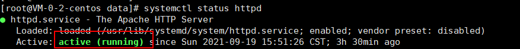
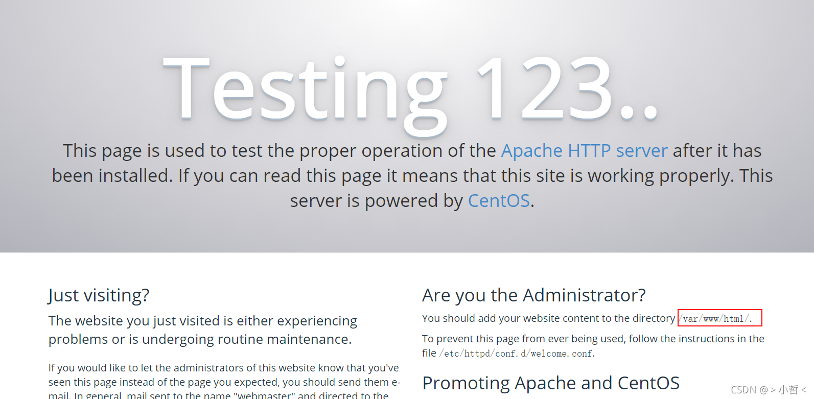

### 命令安装 Apache

```
yum install httpd
```

如果你不是 root 用户，那就加个 sudo 提下权限再安装。

### 启动 Apache

```
apachectl start
```

检测 Apache 服务器状态

```
systemctl status httpd
```

如果运行成功会出现下面的信息



现在可以在浏览器输入服务器的 IP 地址，来看看最终的运行效果，如果成功的话，应该浏览器上会显示下面这张图片的内容：（留意红框里的路径（php 默认路径），word press 要放在这个路径下）



### 设置 Apache 开机启动

我们再把 Apache 服务器设置成开机启动就可以了，运行如下命令：

```
systemctl enable httpd
```

再运行下如下命令看看有没有加入到开机启动中：

```
systemctl list-unit-files | grep httpd
```
